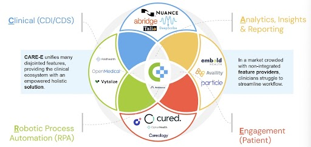

Unlike traditional automation tools, CARE-E is designed specifically for healthcare, with deep EHR integration and AI-driven workflow automation. Our platform requires no complex IT setup and delivers real-time clinical and administrative support at the point of care.

